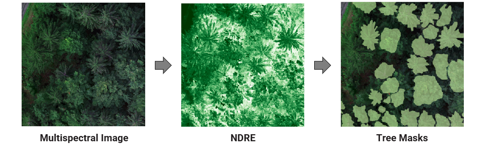

# TreeSeg

A tool for the segmentation of individual trees. It utilizes ArcGIS Pro and Python and allows processing of UAV multispectral images with channels for RGB, near-infrared, and red edge. The tool provides selection among four tested models: Faster R-CNN, Mask R-CNN, TensorMask, and SAM.

For Faster R-CNN, Mask R-CNN, and TensorMask, the NDRE (Normalized Difference Red Edge Index) of the multispectral image is first calculated. Subsequently, instance segmentation is performed, and a shapefile containing the individual trees is generated. It should be noted that, due to the optimal hyperparameter configuration, the calculation using SAM may take more than a day.

## Installation

To run this project, follow these steps:

1. Download the toolbox file [here](https://github.com/soenke-sp/TreeSeg/raw/main/toolbox/TreeSeg.atbx).
2. Open **TreeSeg.atbx** in ArcGIS Pro. See [Connect to a toolbox](https://pro.arcgis.com/en/pro-app/latest/help/projects/connect-to-a-toolbox.htm) for more information.
3. Run the script tool and follow the instructions.

## Usage

1. Import the UAV multispectral image (B, G, R, NIR, RE) into ArcGIS Pro.
2. Select the desired model.
3. Run the script tool to perform the instance segmentation and generate the shapefile of individual trees.  
*Upon first execution of the tool, automatic installation of the required dependencies will occur. This process may take 20 minutes or longer, depending on your internet connection and system performance.*

## Model Checkpoints
The tool automatically downloads the required model checkpoints. For reference, the checkpoints can be found at the following links:

- **Faster R-CNN Checkpoint:** [Download](https://cloud.thws.de/s/kWYdrbqdy4nWig8/download/faster_rcnn_cp.pth)
- **Mask R-CNN Checkpoint:** [Download](https://cloud.thws.de/s/3aSkti5gf9JwCmp/download/mask_rcnn_cp.pth)
- **TensorMask Checkpoint:** [Download](https://cloud.thws.de/s/7ncMw99tdRksroA/download/tensormask_cp.pth)

## Reference
For more detailed information, please refer to the related paper: [Link to Paper]().

## License

This project is licensed under the [MIT License](LICENSE).

## Contact

For questions or feedback, please contact me at [s41166332@gmail.com](mailto:s41166332@gmail.com).
